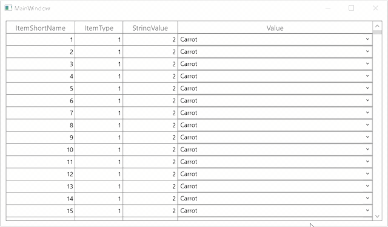

# How to Copy Cell Value of Entire GridTemplateColumn in WPF DataGrid?

This sample show cases how to copy cell value of entire [GridTemplateColumn](https://help.syncfusion.com/cr/wpf/Syncfusion.UI.Xaml.Grid.GridTemplateColumn.html) in [WPF DataGrid](https://www.syncfusion.com/wpf-controls/datagrid) (SfDataGrid).

`DataGrid` does not provide the support copy paste (clipboard) operations in `GridTemplateColumn`. You can achieve this by overriding the [CopyCell](https://help.syncfusion.com/cr/wpf/Syncfusion.UI.Xaml.Grid.GridCutCopyPaste.html#Syncfusion_UI_Xaml_Grid_GridCutCopyPaste_CopyCell_System_Object_Syncfusion_UI_Xaml_Grid_GridColumn_System_Text_StringBuilder__) method in [GridCutCopyPaste](https://help.syncfusion.com/cr/wpf/Syncfusion.UI.Xaml.Grid.GridCutCopyPaste.html) class.

```c#
this.SampleDataGrid.GridCopyPaste = new CustomCopyPaste(this.SampleDataGrid);

public class CustomCopyPaste : GridCutCopyPaste
{
    public CustomCopyPaste(SfDataGrid DataGrid) : base(DataGrid)
    {

    }

    protected override void CopyCell(object record, GridColumn column, ref System.Text.StringBuilder text)
    {
        if (this.dataGrid.View == null)
            return;

        object copyText = null;

        if (column is GridUnBoundColumn)
        {
            var unboundValue = this.dataGrid.GetUnBoundCellValue(column, record);
            copyText = unboundValue != null ? unboundValue.ToString() : string.Empty;
        }
        else
        {
            if (this.dataGrid.GridCopyOption.HasFlag(GridCopyOption.IncludeFormat))
                copyText = this.dataGrid.View.GetPropertyAccessProvider().GetFormattedValue(record, column.MappingName);
            else if (column is GridTemplateColumn && column.MappingName == "Value")
            {
                var dataItem = record as DataItem;
                if (dataItem.ItemType == 1)
                {
                    if (dataItem.ItemShortName <= 200)
                    {
                        var nameValuePair = (dataGrid.DataContext as SampleViewModel).NameValuePair;
                        copyText = nameValuePair[dataItem.StringValue].Name;

                    }
                    else if (dataItem.ItemShortName <= 400)
                    {
                        var nameValuePair = (dataGrid.DataContext as SampleViewModel).NameValuePair1;
                        copyText = nameValuePair[dataItem.StringValue].Name;
                    }
                    else
                    {
                        copyText = dataItem.ItemShortName.ToString() + "" + "th" + " Mango";
                    }
                }
                else if (dataItem.ItemType == 2)
                {
                    copyText = dataItem.DateTimeValue;
                }
                else
                {
                    copyText = dataItem.ItemShortName;
                }
            }
            else
                copyText = this.dataGrid.View.GetPropertyAccessProvider().GetValue(record, column.MappingName);
        }

        var copyargs = this.RaiseCopyGridCellContentEvent(column, record, copyText);

        if (!copyargs.Handled)
        {
            if (this.dataGrid.Columns[leftMostColumnIndex] != column || text.Length != 0)
                text.Append('\t');

            text.Append(copyargs.ClipBoardValue);
        }
    }
}
```



## Requirements to run the demo
 Visual Studio 2015 and above versions